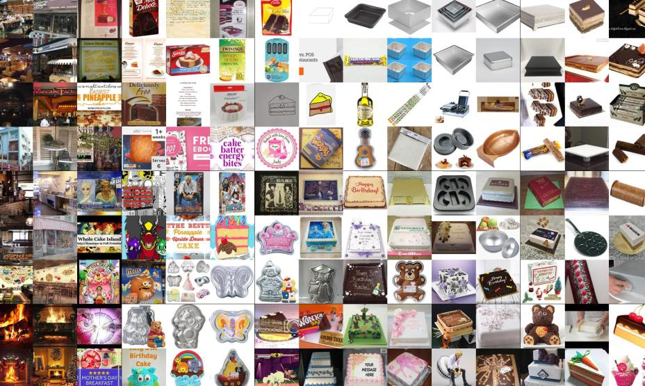
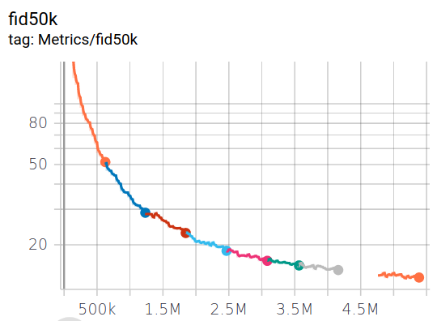
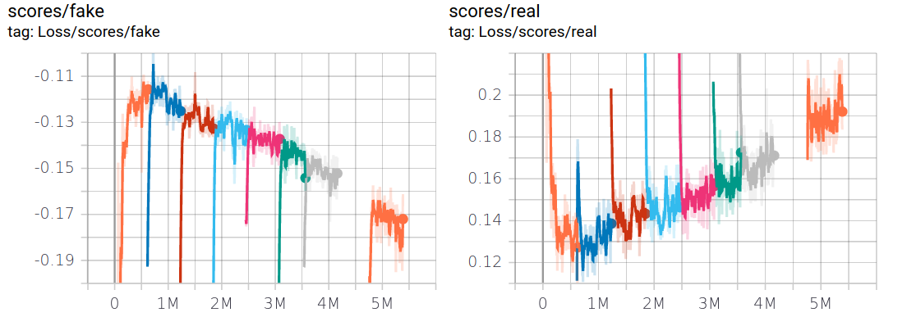
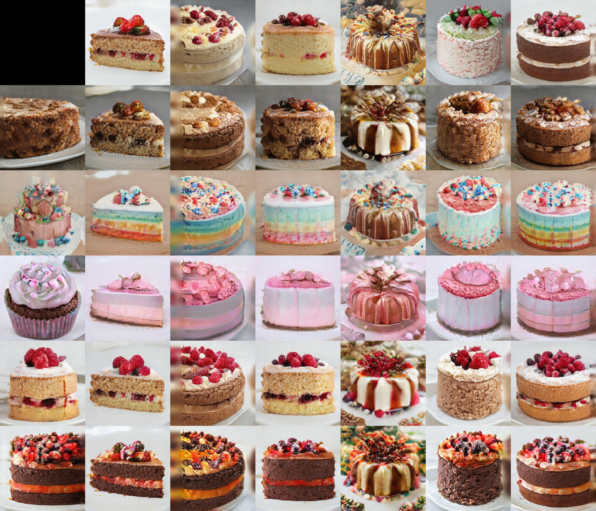
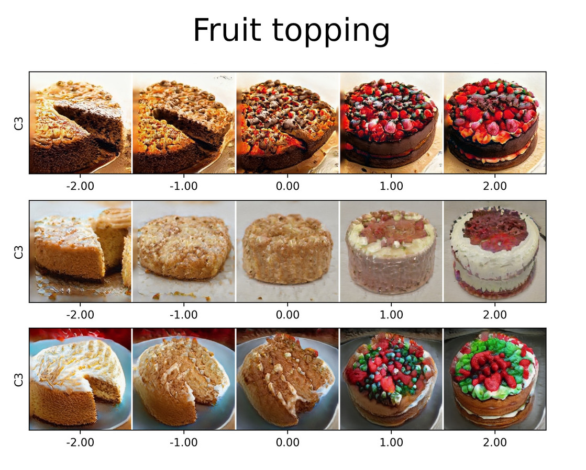
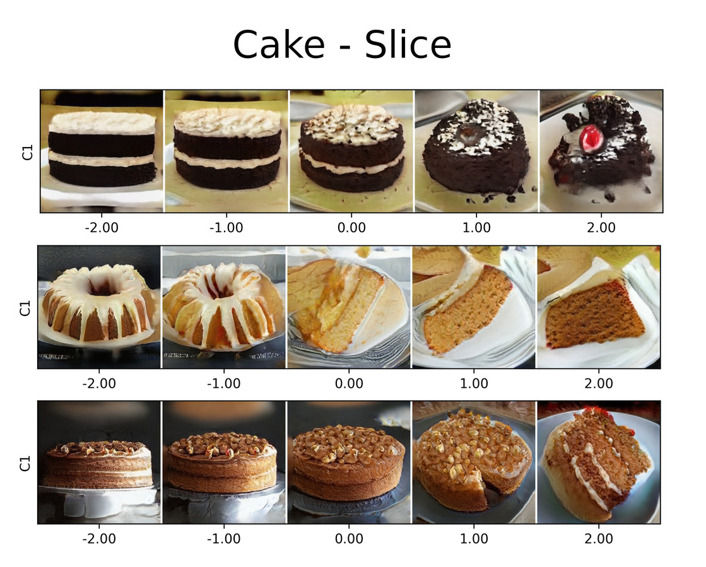
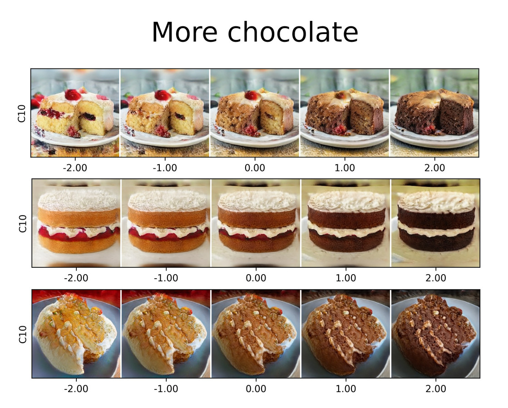

These cakes are a lie, they're all generated by a neural network.

<video controls src="https://assets.justinpinkney.com/blog/cakegan/gridloop.mp4" loop="true" preload="auto"></video>

Random fake cakes are nice, but eventually my grand idea is to make a bespoke cake designer (I'm in this for the latent space you know!). Before I can do that I need to train a model, let's call it CakeGAN. So here is a delightful recipe for how to bake your very own non-existant cakes.

# How to bake a CakeGAN

## Ingredients

- __Data__ - 40,000+ images of cakes of all varieties cut into equal bite-sized pieces
- __Architecture__ - StyleGAN 2
- __Code__ - [My StyleGAN2 fork](https://github.com/justinpinkney/stylegan2)
- __Compute__ - A powerful GPU (Google Colab will do just fine)

## Method

### Collect your data

Scraping an image search engine is a pretty easy way of assembling a pretty huge, but low quality dataset. I used [this Bing image search scraper](https://github.com/ultralytics/google-images-download)[^1] to grab a bunch of images for every search term I could think of relating to cakes. After a little time I had many GBs of (mostly) cake images on my hard drive.

That's the raw material assembled, but it's going to need some refinement first.

### Prepare your data

The images you get back will probably be a pretty mixed bag

In their raw form they're not really suitable for training StyleGAN, in particular the images need to be a fixed aspect ratio (I'm going to go for square). It's a generally accepted piece of Deep Learning Folklore that StyleGAN gives better quality results when trying to generate images which have centrally placed objects[^2].

Conveniently there are a wealth of pre-trained cake detectors available! They aren't usually called that, but it happens that "cake" is one of the categories in the COCO object detection challenge, so any COCO detector can find cakes. Using the best model from [Detectron2](https://github.com/facebookresearch/detectron2) makes this a pretty easy task.

Then sprinkle on a bit of padding, cropping, and resizing as required and that's the main ingredient ready to go, here's what it should look like:

### Train your model

Next it's time to start baking your model in a warm GPU heated oven. The model I'm training is 256x256 (config-e) which is a bit lighter weight than a the full fat 1024x1024 (config-f) model primarily used in the paper.

I use Google Colab for training, and use a fork[^3] of [Skyflynil's StyleGAN2](https://github.com/skyflynil/stylegan2) repo which allows you to keep the training data as jpegs (stuffed inside tfrecords), this keeps that dataset size now to a reasonable number of GBs.

If you get a P100 via Colab the training process takes about 9 minutes per tick[^4] (make sure you optimise your GPU memory usage for the smaller model by setting the `minibatch_gpu_base` to 16). Calculating the FID takes around 10 minutes and I think is worth it to keep track of progress.

Overall I trained for around 5 million images (which works out around 6 days of training) achieving an FID of 13.6. The loss and FID curves are shown below, and you can see that I could have probably kept on training (the FID is still going down and there doesn't seem to be much sign of the discriminator over fitting[^5]) but the gains seemed pretty marginal at that point.

You'll know when your CakeGAN is fully baked when the FID no longer improves, or a skewer inserted comes out clean or it springs back lightly when poked. Here's a small selection of generated cakes.

And below is a zoomable grid arranged using feature extracted using an imagenet pretrained CNN projected into 2D using UMAP.

import BigImage from "../../../src/components/BigImage"

<BigImage
    options={ {center:[-0.25, 0.35], zoom:12, minZoom:9, maxZoom:15 } }
    tile_url="https://assets.justinpinkney.com/blog/cakegan/cakes-generated_files//{z}/{x}_{y}.jpg" />

You can download the final trained model from my [Awesome Pretrained StyleGAN 2 repo](https://github.com/justinpinkney/awesome-pretrained-stylegan2/#cakes).

### Serving

Once we've the model has cooled it should be serving up some delicious interpolation videos. But the best part of a well baked GAN is the smooth and creamy latent space. For a start StyleGAN is famous (in part) for its style mixing capabilities, so let's mix some cakes.

If I want to make a cake editor I need to try and find meaningful directions in the latent space. I've got a dataset with some noisy labels I could try and use, but for a first pass using [GANSpace](https://github.com/harskish/ganspace) is a quick and easy way of trying to automatically find meaningful directions[^ganspace-notebook].

Some of the directions found by GANSpace seem promising, there are some hints of cake to slice, or more chocolate or fruit topping vectors. But the results below are very cherry picked and these don't seem to generalise terribly well.

[^1]: This scraper is based on a Google image scraper which now seems to have been broken by changes in the Google images search page.

[^2]: This may be due to the fact that StyleGAN uses a learned constant as the input to the convolutions, but I'm not aware of any actual evidence for this, (it's more deep learning hearsay than folklore).

[^3]: There are so many different forks of the original StyleGAN2 repo that it is a bit of a nightmare. If someone was feeling adventurous they could try and collect all the features into one. The closest I know for this is [Peter Baylies fork](https://github.com/pbaylies/stylegan2), but last time I tried to use it, it was broken 🤷.

[^4]: 1 tick corresponds to 6000 images

[^5]: To check this I'd like to use the heuristic presented in ["Training Generative Adversarial Networks with Limited Data"](https://arxiv.org/abs/2006.06676) which is the average value of the sign of D(real), but I don't have access to this data.

[^ganspace-notebook]: I've been using this [handy Colab notebook](https://twitter.com/realmeatyhuman/status/1263153937596719106) from [@realmeatyhuman](https://twitter.com/realmeatyhuman) for running GANSpace